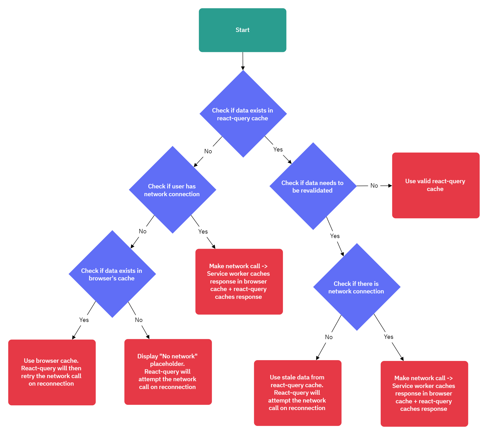

# React Barebones Template

---

-  [React Barebones Template](#react-barebones-template)
   -  [Initial Setup - Start:](#initial-setup---start)
   -  [Initial Setup - PWA:](#initial-setup---pwa)
      -  [Updating App Name \& Details:](#updating-app-name--details)
      -  [Updating App Logo:](#updating-app-logo)
   -  [Initial Setup - Firebase Setup:](#initial-setup---firebase-setup)
      -  [In Firebase Console:](#in-firebase-console)
      -  [In VS Code:](#in-vs-code)
   -  [Initial Setup Final Steps:](#initial-setup-final-steps)
      -  [--- INITIAL SETUP COMPLETE ---](#----initial-setup-complete----)
   -  [Service Worker \& Caching Config:](#service-worker--caching-config)
      -  [Preliminary Information on Runtime Caching:](#preliminary-information-on-runtime-caching)
      -  [Default Runtime Config Caching Architecture:](#default-runtime-config-caching-architecture)
   -  [UI Config:](#ui-config)
      -  [Updating Themes \& Colors](#updating-themes--colors)
      -  [Viewing UI Component Examples:](#viewing-ui-component-examples)
   -  [Final Deployment of Completed App Instructions:](#final-deployment-of-completed-app-instructions)
      -  [This Repository:](#this-repository)
      -  [Firebase Updates:](#firebase-updates)
      -  [Setting up a Custom Domain for the Firebase Project:](#setting-up-a-custom-domain-for-the-firebase-project)
         -  [Preliminary Information:](#preliminary-information)
         -  [Steps:](#steps)

---

## Initial Setup - Start:

1. Run `npm install` in the root directory
2. Close and reopen the project in VSCode to refresh the .tsconfig file

---

## Initial Setup - PWA:

### Updating App Name & Details:

1. In the VS Code search bar, search for `App Name` -> replace all instances of this with the app's name
2. In the VS Code search bar, search for `App Description` -> replace all instances of this with the App's description
3. In the VS Code search bar, search for `app-name` -> replace all instances of this with the app's name

### Updating App Logo:

1. Create a 192x192 png image of the logo and save it as `logo-192x192`
   -  _if the logo is a css component then render it on the App.tsx component -> screenshot it -> then use online tools to get rid of the background and resize it to 192x192px_
2. Go to _root/public/icons_ -> replace the `logo-192x192.png` file with the file of the new logo
3. Repeat steps 1 & 2 for a 512x512 sized png image of the logo
4. Go to _root/public/icons_ -> copy the `logo-192x192.png` file -> paste it in _root/resources/icons_

---

## Initial Setup - Firebase Setup:

### In Firebase Console:

1. Create a new firebase project
2. Enable Google Analytics
3. Enable the option to add a Web App (_don't check Firebase Hosting_)
4. Change the Firebase plan to Blaze
5. Enable any Firebase services you want to use (_e.g. Authentication, Firestore, etc._)
6. Go to Project Settings -> General -> set the _Project Name_ to the app's name
7. Copy the _Project ID_ (_this will be used later_)

### In VS Code:

1. Go to _root/package.json_ -> replace `[proj-id]` with the copied firebase project id
2. Install Firebase CLI globally (_if not already installed_)
3. In terminal, run `firebase login` and login to your firebase account
4. In terminal, run `firebase init` and choose the following options:
   -  Service: `Hosting` (_the hosting option that does not also set up GitHub Actions_)
   -  Project: `Use an existing project`
   -  Select a project: `[the copied firebase project id]`
   -  Public Directory: `dist`
   -  Single Page App: `n`
   -  Automatic Builds with GitHub Actions: `n`
5. Go to _root/firebase.json_ -> add the following within the `hosting` object:

```javascript
      "rewrites": [
      {
         "source": "**",
         "destination": "/index.html"
      }
   ]
```

6. Go to Firebase Console -> Project Settings -> General -> scroll down to the Firebase Config
7. In the root directory, create a _.env_ file
8. Create the following fields in the _.env_ file and copy the values from the Firebase Config (**_without the speech marks_**):
   -  `VITE_APIKEY=[apiKey value in the firebase config]`
   -  `VITE_AUTHDOMAIN=[authDomain value in the firebase config]`
   -  `VITE_PROJECTID=[projectId value in the firebase config]`
   -  `VITE_STORAGEBUCKET=[storageBucket value in the firebase config]`
   -  `VITE_MESSAGINGSENDERID=[messagingSenderId value in the firebase config]`
   -  `VITE_APPID=[appId value in the firebase config]`
   -  `VITE_MEASUREMENTID=[measurementId value in the firebase config]`

---

## Initial Setup Final Steps:

1. In terminal, run `npm run start` to test if the app is running correctly locally
2. In terminal, run `npm run deploy` to deploy the app to Firebase Hosting -> then visit the URL outputted by terminal to check if the deployed app is running correctly

---

### --- INITIAL SETUP COMPLETE ---

---

## Service Worker & Caching Config:

_Service worker and caching config options can be found in vite.config.ts_

### Preliminary Information on Runtime Caching:

-  `urlPattern: /^https?.*/` -> all http requests will be cached
-  `handler: 'NetworkFirst'` -> The service worker will first try to fetch the request from the network, if it fails, it will then try to fetch it from the cache. Other handler options include:
   1. `NetworkOnly` -> The service worker will only try to fetch the request from the network
   2. `CacheFirst` -> The service worker will first try to fetch the request from the cache, if it fails, it will then try to fetch it from the network
   3. `CacheOnly` -> The service worker will only try to fetch the request from the cache
   4. `StaleWhileRevalidate` -> The service worker will first try to fetch the request from the cache, if it fails, it will then try to fetch it from the network. If the network request is successful, the service worker will update the cache with the new response
-  `method: GET` -> by default, service workers only cache GET requests. This is added just to make it more verbose
-  `maxEntries: 500` -> the maximum number of entries the cache can hold
-  `maxAgeSeconds: twoHoursInSeconds` -> cache entries are set to expire after 2 hours
-  `cacheableResponses: [ { statuses: [0, 200] } ]` -> only cache responses with a status code of 0 or 200 to avoid caching errors
-  `matchOptions: { ignoreSearch: false }` -> Do not ignore the query string when matching a request to a cache entry _(microservices are passed through as a query string so that the cache can differentiate between different requests sent to the same api-gateway url)_

### Default Runtime Config Caching Architecture:

**_Process Flow Diagram (Service-Worker & React-Query Caching Integration):_**


---

## UI Config:

### Updating Themes & Colors

1. Go to _root/src/global/styles/colors.tsx_
2. Update the color values in the `Color` class

### Viewing UI Component Examples:

-  Go to _root/src/global/components/examples/ExampleUIComponents.tsx_ to view a list of example functional components that use the UI components
-  To view what the example component looks like, simply import and render it into _App.tsx_
-  **_NOTE_**: _Some animations for these components may not work if animated effects are disabled in Windows 11 settings_

---

## Final Deployment of Completed App Instructions:

### This Repository:

1. Open this repository in VSCode
2. In the search bar, search for `styled-ic` -> make sure all styled icons that are imported have an `@` symbol at the beginning of the path. If not, then update the path by:
   1. Add a `@` symbol to the beginning of the path
   2. Add `/[StyledIconName]` to the end of the path
3. In terminal, run `npm run lint-ts` -> fix any errors that are found

### Firebase Updates:

1. Go to Firebase Console -> Authentication -> Templates -> Email address verification -> Update the _Sender name_ field to `[App Name]`
2. Go to Firebase Console -> Authentication -> Templates -> Password Reset -> Update the _Sender name_ field to `[App Name]`
3. Go to Firebase Console -> Authentication -> Templates -> Email address change -> Update the _Sender name_ field to `[App Name]`
4. Go to Firebase Console -> Authentication -> Templates -> Multi-factor enrolment -> Update the _Sender name_ field to `[App Name]`

### Setting up a Custom Domain for the Firebase Project:

#### Preliminary Information:

_Depending on which domain provider you buy your domain from, you may have to use a different `host` field value to what firebase wants you to use when updating the DNS Records. You will have to read the domain provider's documentation to figure out what correlates to what. For example, for SquareSpace:_

-  If Firebase wants you to use the host name "example.com" for a record, you will have to use "@" instead as this is what SquareSpace uses to represent the root domain
-  If Firebase wants you to use the host name "www.example.com" for a record, you will have to use "www" instead as this is what SquareSpace uses to represent the www subdomain

#### Steps:

1. Buy the domain from a website like SquareSpace or GoDaddy
2. Go to the DNS Settings of your domain provider -> Delete any existing DNS records
3. For the Firebase project, open the Firebase Console -> Hosting -> Press _Add custom domain_
4. Enter the domain name you bought (e.g. `example.com`) -> Press _Continue_
5. Go to the DNS Settings of your domain provider -> Add the records that are listed in firebase (read the preliminary information section above for more info)
6. Press _Verify_ in Firebase (it may take a while for the DNS records to update, but you can move on to the next steps)
7. Repeat steps 2-5 for the www subdomain (e.g. `www.example.com`)
8. Wait for both domains to be verified in Firebase (the status will change to _Connected_ when it's verified)
9. Go to Firebase Console -> Hosting -> hover over the domain without the www (e.g.`example.com`) -> press the 3 vertical dots -> press _Edit_ -> press _Redirect this domain to another_ -> enter the domain with the www (e.g. `www.example.com`) -> press _Done_
10.   Go to Firebase Console -> Authentication -> Settings -> Authorized Domains -> Add the custom domains to the list of authorized domains (e.g. `example.com` and `www.example.com`)
11.   Go to Firebase Console -> Authentication -> Templates -> Email address verification -> Customise domain -> type in the name of your custom domain (e.g. `example.com`) -> press _Continue_
12.   Open the DNS Settings of your custom domain -> Add the records that are listed in firebase (read the preliminary information section above for more info)
13.   Press _Verify_ in Firebase (it may take a while for the DNS records to update, but you can move on to the next steps)
14.   Go to _root/index.html_ -> add the following script tag to the head of the document (which redirects the user to the custom domain if they try to access the firebase default domains):

```html
<script>
   if (
      window.location.hostname === '[firebase-proj-id].firebaseapp.com' ||
      window.location.hostname === '[firebase-proj-id].web.app'
   ) {
      window.location.replace('https://[exampledomain.com]');
   }
</script>
```

12. In the _API Gateway_ project repo, go to the CorsPolicy.tsx file -> add the custom domains
    to the list of allowed origins (e.g. `https://example.com` and `https://www.example.com`)
